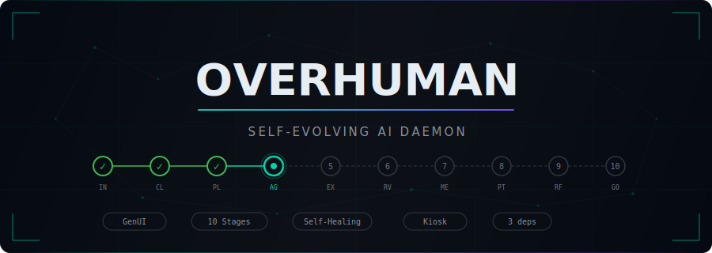
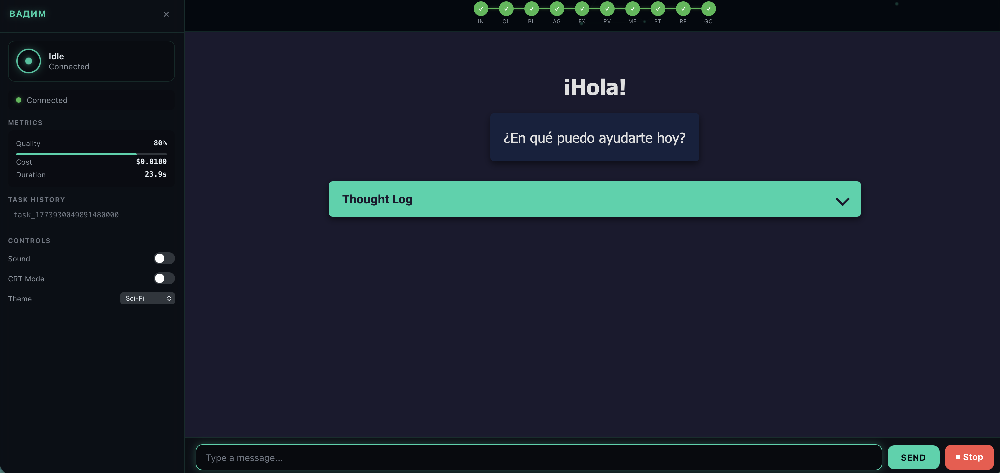
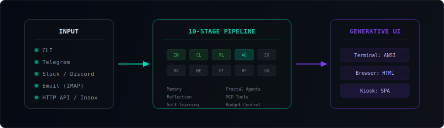
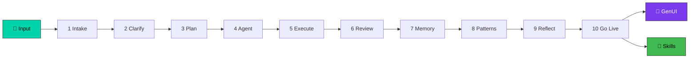

<p align="center">
  
</p>

<p align="center">
  &ensp;
  &ensp;
  &ensp;
  <a href="LICENSE"></a>
</p>

<br>

<p align="center">
  <strong>Overhuman</strong> is an always-on AI daemon that processes tasks through a <strong>10-stage pipeline</strong><br>
  and <strong>generates a unique visual interface for every response</strong> — not from templates, but from scratch.<br>
  It learns from repetition, auto-generates code skills that replace LLM calls,<br>
  and gets <strong>cheaper with every request</strong>.
</p>

<p align="center">
  <a href="docs/SPEC.md">Spec</a> ·
  <a href="docs/SPEC_DYNAMIC_UI.md">GenUI Spec</a> ·
  <a href="docs/ARCHITECTURE.md">Architecture</a> ·
  <a href="docs/PHASES.md">Phases</a> ·
  <a href="#-quick-start">Quick Start</a>
</p>

<br>

<p align="center">
  
</p>

<p align="center">
  <sub>Kiosk companion display — pipeline HUD, neural canvas, metrics panel, theme controls. Pure Go, zero JS frameworks.</sub>
</p>

---

## 🎨 Generative UI — The Core Feature

Most AI assistants return plain text. Some pick from pre-built component catalogs. **Overhuman generates complete UI from scratch for every response.**

```
 "Analyze server logs"  →  Interactive dashboard with latency charts, error heatmap, filterable table
 "Compare Q1 vs Q2"     →  Side-by-side cards with sparklines and delta highlights
 "Draft an email"       →  Rich editor with tone slider and preview pane
 "Explain this code"    →  Syntax-highlighted walkthrough with collapsible sections
```

No component registry. No JSON schema. The agent decides the best visualization — charts, tables, forms, games, timelines — whatever fits the data.

<br>

### Where Overhuman sits in the ecosystem

```
                        Agent Freedom
                             ▲
                             │
  Level 3 ─── Fully     ┌───┴────────────────────┐
  Generated              │  Gemini Dynamic View   │
                         │  Claude Artifacts      │
                         │  ★ OVERHUMAN           │
                         └────────────────────────┘
                             │
  Level 2 ─── Declarative   │  Google A2UI
                             │  Yandex DivKit
                             │
  Level 1 ─── Controlled    │  Vercel AI SDK
                             │  AG-UI
                             │
              ───────────────┴─────────────────────► Safety
                   Low                          High
```

> [!NOTE]
> **Level 1-2** limit the agent to what a developer pre-built. **Level 3** means infinite UI surface — the agent can create any visualization it can imagine. The tradeoff is sandboxing (solved) and non-determinism (solved via self-healing + reflection). Google's research confirms LLMs are effective UI generators, achieving ELO 1710 against human-crafted designs ([paper](https://generativeui.github.io/)).

<br>

### Three rendering targets

<table>
<tr>
<td width="33%" align="center">

**🖥️ Terminal**

ANSI escape codes + box drawing

*CLI over SSH, no browser*

</td>
<td width="33%" align="center">

**🌐 Browser**

HTML + CSS + JS via WebSocket

*Sandboxed iframe — no data leak*

</td>
<td width="33%" align="center">

**📺 Kiosk**

Full-screen SPA on any screen

*Tablet / wall mount / desktop*

</td>
</tr>
</table>

<br>

### Kiosk: the companion display

A full-screen web app designed for a dedicated screen — tablet on your desk, monitor on the wall, or a browser window you keep open.

<table>
<tr>
<td width="50%">

- **Pipeline HUD** — real-time progress through all 10 stages
- **Generated UI** — each response as a rich HTML app in sandboxed iframe
- **Neural canvas** — animated particles that react to pipeline activity
- **Agent status ring** — visual daemon heartbeat

</td>
<td width="50%">

- **Metrics panel** — tasks, skills, memory entries
- **Theme system** — sci-fi · cyberpunk · clean
- **Sound engine** — Web Audio API synthesis (zero files)
- **CRT mode** — scanlines + glow for retro aesthetic

</td>
</tr>
</table>

> [!TIP]
> **Device-adaptive**: phone → essentials only (no HUD, overlay sidebar) · tablet → control pad · desktop → full command center.

<br>

### Self-healing UI

```
LLM generates HTML ──→ Render in sandbox ──→ Error?
                                              │
                            ┌─── Yes ─────────┤
                            │                  └─── No ──→ Track interactions
                            ▼                              (clicks, scrolls, ignores)
                    Feed error to LLM                              │
                    Retry (max 2)                                  ▼
                            │                         Feed back into generation
                      Still broken?                          │
                       ├─ Yes → Plain text fallback           ▼
                       └─ No  → Serve healed UI         Next UI is better
```

> UI generation cost: ~$0.001 (gpt-4.1-nano). Skipped for short text answers.

---

## ⚙️ How It Works

<p align="center">
  
</p>



Every request passes through the full 10-stage pipeline. Stages 7-9 feed back into the system — this is how Overhuman learns:

<table>
<tr>
<td width="50%">

**🧠 Memory** — stores results in short-term + long-term (SQLite FTS5)

**🔁 Patterns** — fingerprints recurring tasks

**🪞 Reflection** — 4 levels of self-improvement:

| Level | When | Does |
|-------|------|------|
| Micro | Each step | Adjusts next step |
| Meso | Each task | Updates skills |
| Macro | Every N tasks | Reevaluates strategies |
| Mega | Rarely | Evaluates reflection itself |

</td>
<td width="50%">

**⚡ Self-learning** — the killer loop:

```
 Task repeated 3x
       │
       ▼
 Generate code skill
 from accumulated examples
       │
       ▼
 Register as deterministic
 alternative to LLM call
       │
       ▼
 Next occurrence → code
 (ms, not seconds. Free, not $0.01)
       │
 Code breaks? → auto-fallback to LLM
```

</td>
</tr>
</table>

---

## ⚡ Features

<table>
<tr>
<td width="50%">

📡 **6 Input Channels**
CLI · Telegram · Slack · Discord · Email · HTTP API

🤖 **Any LLM Provider**
OpenAI · Claude · Ollama · Groq · Together · OpenRouter

🧠 **Memory System**
Short-term + long-term (FTS5) + pattern tracking

🔄 **Self-Learning**
3x repeat → auto code skill → LLM replaced

🛠️ **20 Skills**
Code gen, search, translate, summarize, email + stubs

</td>
<td width="50%">

🌳 **Fractal Agents**
Tree hierarchy, delegation, best-of-N, per-agent memory

🪞 **4-Level Reflection**
Micro → Meso → Macro → Mega improvement loop

🔐 **Security-First**
AES-256-GCM · injection protection · audit trail · sandbox

⏰ **Always-On Daemon**
OS service (launchd/systemd) · heartbeat · proactive goals

🔌 **MCP Tools**
Model Context Protocol for external tool integration

</td>
</tr>
</table>

---

## 🚀 Quick Start

```bash
# Build
go build -o overhuman ./cmd/overhuman/

# Configure (interactive wizard — provider, API key, model)
./overhuman configure

# Chat mode
./overhuman cli

# Or: daemon with HTTP API + WebSocket + Kiosk UI
./overhuman start
```

> [!TIP]
> **Zero-config local mode** — no API key needed:
> ```bash
> LLM_PROVIDER=ollama ./overhuman cli
> ```

### Try it

```bash
# Start daemon
./overhuman start

# Send a task
curl -s http://localhost:9090/input/sync \
  -H "Content-Type: application/json" \
  -d '{"payload": "What is the capital of France?"}'

# Open Kiosk companion display
open http://localhost:9092
```

---

## 🖥️ Deployment

```bash
overhuman doctor       # diagnostics
overhuman install      # install as OS service
overhuman status       # check daemon
overhuman stop         # graceful shutdown
overhuman logs         # tail last 50 lines
overhuman update       # check & apply (SHA256 verified)
overhuman uninstall    # remove OS service
```

| Port | Service | Description |
|:----:|---------|-------------|
| `9090` | **HTTP API** | REST (`/input`, `/input/sync`, `/health`) |
| `9091` | **WebSocket** | Real-time UI streaming (RFC 6455, pure stdlib) |
| `9092` | **Kiosk** | Full-screen companion display |

> File drop: `~/.overhuman/inbox/` — daemon picks up automatically.
> Logs: stdout + `~/.overhuman/logs/overhuman.log`.

---

## 🧩 Supported LLMs

| Provider | API Key | Models |
|----------|:-------:|--------|
| **OpenAI** | Required | o3, o4-mini, GPT-4.1 |
| **Anthropic Claude** | Required | Claude Sonnet, Haiku, Opus |
| **Ollama** | — | Local models (llama3, mistral, etc.) Free |
| **LM Studio** | — | Local models via GUI |
| **Groq** | Required | Fast inference (Llama, DeepSeek, Qwen) |
| **Together AI** | Required | Open-source models hosted |
| **OpenRouter** | Required | All models through a single key |
| **Custom** | Optional | Any OpenAI-compatible server |

---

## 🏗️ Technical Decisions

| Decision | Choice | Why |
|----------|--------|-----|
| Language | **Go** | Daemon-first, goroutines, single binary 15MB, <10MB RAM |
| Storage | **SQLite + files** | Self-contained, FTS5 for search, human-readable |
| Dependencies | **3 total** | `google/uuid`, `modernc.org/sqlite`, `golang.org/x/term` |
| Tools | **MCP** | Industry standard (Anthropic + OpenAI + Google + Microsoft) |
| Sandbox | **Docker** | Isolation for auto-generated code |
| Encryption | **AES-256-GCM** | Authenticated encryption for stored keys |

<details>
<summary><strong>📁 Project Structure</strong> — 21 packages, single binary</summary>

<br>

```
cmd/overhuman/       — entry point (daemon, CLI, configure, doctor)
internal/
├── soul/            — agent identity (markdown DNA, versioning)
├── agent/           — fractal agent hierarchy
├── pipeline/        — 10-stage orchestrator + DAG executor
├── brain/           — LLM integration, model routing, context assembly
├── senses/          — input channels (CLI, HTTP, Telegram, Slack, Discord, Email)
├── instruments/     — skill system (LLM/Code/Hybrid), code generator, Docker sandbox
├── memory/          — short-term + long-term memory + patterns + shared knowledge base
├── reflection/      — 4 levels of reflection
├── evolution/       — fitness metrics, A/B testing, skill culling
├── goals/           — proactive goal engine
├── budget/          — cost control, limits, budget-based routing
├── versioning/      — versioning with auto-rollback on degradation
├── security/        — sanitization, audit, encryption, validation
├── mcp/             — MCP client and registry (JSON-RPC 2.0)
├── storage/         — persistent KV store (SQLite, FTS5, TTL)
├── genui/           — generative UI (LLM → ANSI/HTML, self-healing, reflection)
├── deploy/          — PID management, OS service templates, auto-update
├── skills/          — 20 starter skills
└── observability/   — structured logs and metrics
```

</details>

<details>
<summary><strong>⚙️ Configuration</strong> — environment variables (override config.json)</summary>

<br>

```
ANTHROPIC_API_KEY   — Claude key
OPENAI_API_KEY      — OpenAI key
LLM_PROVIDER        — provider: openai, claude, ollama, groq, together, openrouter, custom
LLM_API_KEY         — key for any provider
LLM_MODEL           — default model
LLM_BASE_URL        — URL for custom/ollama
OVERHUMAN_DATA      — data directory (default ~/.overhuman)
OVERHUMAN_API_ADDR  — API address (default 127.0.0.1:9090)
OVERHUMAN_NAME      — agent name
```

</details>

---

## 🌐 HTTP API

```bash
# Async (fire-and-forget)
curl -X POST http://localhost:9090/input \
  -H "Content-Type: application/json" \
  -d '{"payload": "Analyze this CSV file", "sender": "user1"}'

# Sync (waits for response)
curl -X POST http://localhost:9090/input/sync \
  -H "Content-Type: application/json" \
  -d '{"payload": "Translate to French: Hello world"}'

# Health check
curl http://localhost:9090/health
```

---

## 🧪 Tests

```bash
go test ./...         # 981 tests, 21 packages
go test ./... -race   # race condition checks
```

All tests run with a mock LLM server — no API keys needed.

---

## 📚 Docs

| Document | Description |
|----------|-------------|
| [`docs/SPEC.md`](docs/SPEC.md) | Full specification (700+ lines) |
| [`docs/SPEC_DYNAMIC_UI.md`](docs/SPEC_DYNAMIC_UI.md) | Generative UI specification (1186 lines) |
| [`docs/PHASES.md`](docs/PHASES.md) | Implementation tracker |
| [`docs/ARCHITECTURE.md`](docs/ARCHITECTURE.md) | Architecture overview |

---

<p align="center">
  
  
  
</p>
<p align="center">
  <sub>MIT License · <a href="CONTRIBUTING.md">Contributing</a></sub>
</p>
